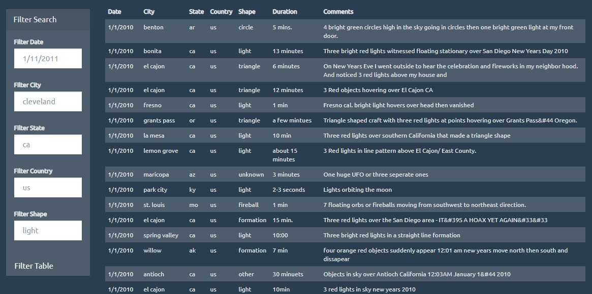
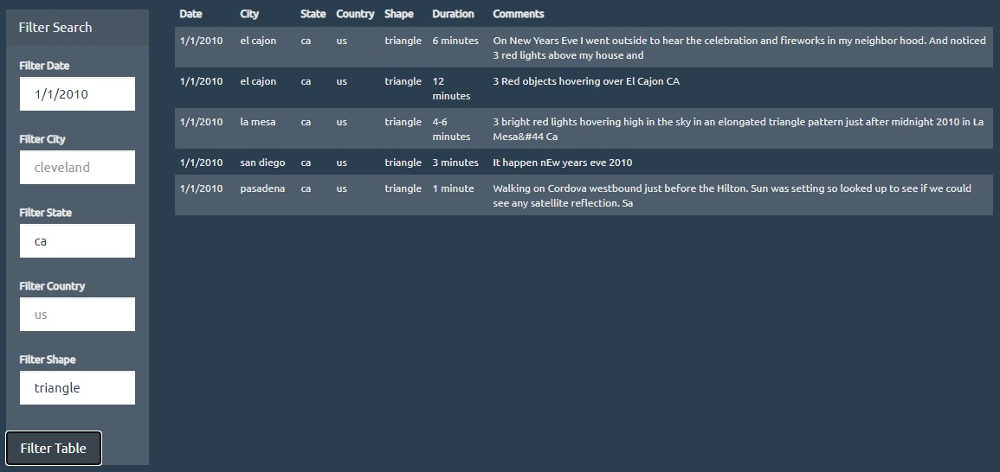

# UFO Sightings Searches

## Background

We have a large dataset of UFO sightings in DOM format. We want to make it easier to search. The first goal is to take the data, and add a table, row by row to the html page, using javascript. The second goal is to allow filtering on the table based on the relevant columns, using a form and javascript.

### The relevant columns are:

- `date/time`
- `city`
- `state`
- `country`
- `shape

### Before filtering:

### After filtering:

